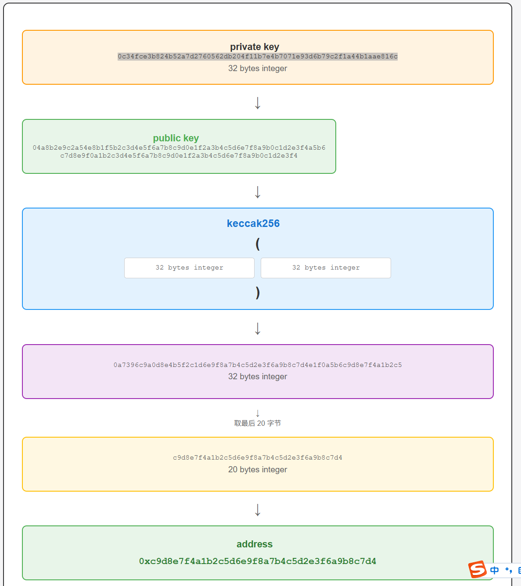

# Keccak256 哈希介绍

## 什么是 Keccak256

**Keccak256** 是 Keccak 哈希算法家族中的一种变体，输出长度为 **256 位**（32 字节）。它是以太坊（Ethereum）等区块链系统中广泛使用的核心哈希函数。

## 历史背景

- **2012年**：由 Guido Bertoni 等人提出的 Keccak 算法赢得了 **NIST SHA-3 竞赛**
- **标准化**：NIST 基于 Keccak 制定了 SHA-3 标准
- **区块链应用**：以太坊选择了原始的 Keccak 实现，而非 NIST 标准化后的 SHA-3

> keccak256哈希算法在以太坊中也被称为SHA3算法，但是要注意，keccak算法原本是SHA3的候选算法，然而在SHA3最后的标准化时，对keccak做了改进，因此，标准的SHA3算法和keccak是不同的，只是以太坊在开发时就选择了尚未成为SHA3标准的keccak算法。

## Keccak256 vs SHA3-256

这是一个重要的区别点：

| 特性 | Keccak256 | SHA3-256 |
|------|-----------|----------|
| 基础算法 | Keccak | Keccak |
| 填充方式 | 原始 Keccak 填充 | NIST 标准填充 |
| 输出长度 | 256 位 | 256 位 |
| 结果相同 | ❌ | ❌ |
| 以太坊使用 | ✅ | ❌ |

> **重要**：Keccak256 ≠ SHA3-256，它们的哈希结果是不同的！

## 核心特性

### 安全特性
- **单向性**：从哈希值无法反推原始数据
- **确定性**：相同输入始终产生相同输出
- **抗碰撞性**：极难找到两个不同输入产生相同哈希值
- **雪崩效应**：输入的微小变化导致输出完全不同

### 技术规格
- **输出长度**：256 位（64 个十六进制字符）
- **输入长度**：任意长度
- **速度**：比 SHA-2 系列更快
- **安全性**：比 SHA-2 更高的安全边际

## 在以太坊中的应用

### 1. 地址生成

以太坊地址生成流程：

```
私钥 → 公钥 → Keccak256(公钥) → 0x(前缀) + 取后20字节 → 以太坊地址
```

**示例**：
```
公钥: 04a34b99f22c7...（64字节）
Keccak256哈希: 12890d2cce102d...（32字节）
以太坊地址: 0x2cce102d5ba91...（0x+取后20字节）
```



### 2. 函数选择器

智能合约中的函数调用通过 Keccak256 生成选择器：

```
函数签名: transfer(address,uint256)
Keccak256哈希: a9059cbb2ab09eb1...
函数选择器: 0xa9059cbb（前4字节）
```

### 3. 事件主题

智能合约事件的主题也使用 Keccak256：

```
事件签名: Transfer(address,address,uint256)
主题哈希: 0xddf252ad1be2c89b69c2b068fc378daa952ba7f163c4a11628f55a4df523b3ef
```

### 4. 数据完整性验证

- 区块头哈希计算
- 交易哈希生成
- Merkle 树节点计算

## 代码示例

### Python 实现

```python
from Crypto.Hash import keccak

def keccak256_hash(data):
    """计算数据的 Keccak256 哈希值"""
    k = keccak.new(digest_bits=256)
    if isinstance(data, str):
        data = data.encode('utf-8')
    k.update(data)
    return k.hexdigest()

# 示例使用
message = "Hello, Blockchain!"
hash_result = keccak256_hash(message)
print(f"原始数据: {message}")
print(f"Keccak256: {hash_result}")
```

### JavaScript 实现（使用 ethers.js）

```javascript
const { ethers } = require('ethers');

function keccak256Hash(data) {
    // ethers.js 自动处理字符串到字节的转换
    return ethers.utils.keccak256(ethers.utils.toUtf8Bytes(data));
}

// 示例使用
const message = "Hello, Blockchain!";
const hashResult = keccak256Hash(message);
console.log(`原始数据: ${message}`);
console.log(`Keccak256: ${hashResult}`);
```

### Solidity 实现

```solidity
pragma solidity ^0.8.0;

contract Keccak256Demo {
    function computeHash(string memory data) public pure returns (bytes32) {
        return keccak256(abi.encodePacked(data));
    }
    
    function computeFunctionSelector(string memory signature) public pure returns (bytes4) {
        return bytes4(keccak256(abi.encodePacked(signature)));
    }
}
```

## 实际应用场景

### 1. 数字签名验证

```python
# 验证消息完整性
original_message = "重要的交易数据"
message_hash = keccak256_hash(original_message)

# 传输后验证
received_message = "重要的交易数据"
received_hash = keccak256_hash(received_message)

if message_hash == received_hash:
    print("数据完整性验证通过")
else:
    print("数据可能被篡改")
```

### 2. 密码存储

```python
def store_password(password, salt):
    """安全存储密码"""
    combined = password + salt
    return keccak256_hash(combined)

def verify_password(password, salt, stored_hash):
    """验证密码"""
    return store_password(password, salt) == stored_hash
```

## 安全考虑

### 优势
- **现代化设计**：基于新的密码学原理
- **高安全边际**：抵抗各种已知攻击
- **高效性能**：适合区块链等高频使用场景
- **标准化**：基于国际标准的 Keccak 算法

### 注意事项
- **不要用于密码存储**：应该使用专门的密码哈希函数（如 Argon2）
- **添加盐值**：防止彩虹表攻击
- **定期更新**：关注密码学发展，适时升级算法

## 工具和库推荐

### Python
- **pycryptodome**：`pip install pycryptodome`
- **hashlib**（标准库）：注意区分 SHA3 和 Keccak

### JavaScript
- **ethers.js**：`npm install ethers`
- **keccak**：`npm install keccak`
- **crypto-js**：`npm install crypto-js`

### 其他语言
- **Go**：`golang.org/x/crypto/sha3`
- **Rust**：`sha3` crate
- **Java**：Bouncy Castle 库

## 总结

Keccak256 作为以太坊生态系统的核心哈希函数，在区块链技术中发挥着重要作用。它不仅提供了高安全性的哈希计算，还是智能合约、地址生成、数据验证等关键功能的基础。

**关键要点**：
- Keccak256 ≠ SHA3-256（填充方式不同）
- 广泛应用于以太坊生态系统
- 提供 256 位高安全性哈希输出
- 适合区块链等高性能要求场景

理解和掌握 Keccak256 对于区块链开发者来说是必不可少的基础知识。

---

> **提示**：本教程介绍了 Keccak256 的基本概念和应用。在实际项目中，建议使用经过验证的密码学库，避免自行实现哈希算法。