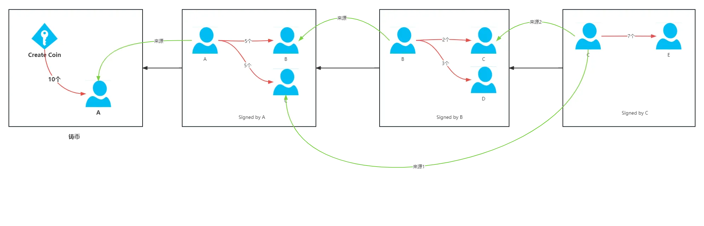

# 共识协议

## 数字货币的问题

如果央行通过发行一种数字货币，采用公私钥对进行签名，央行存储私钥，将公钥公布出去。用户可以通过公钥验证收到的数字货币的真伪。

但是这种会存在一种致命的问题：**"双花"攻击（double spending attack）**，即一笔钱被花了两次甚至多次。用户在得到数字货币后，对文件进行复制，就等于又得到了一份数字货币。数字货币面临的主要挑战就是**防止双花攻击(重放攻击)**。

### 中心化解决方案

如果央行对数字货币进行编号，每份数字货币上都有一个专门的编号，央行需要维护一张特别大的数据库表，用来记录哪个编号的货币在哪个人手里。交易的时候，不仅要验证货币的签名，还要从央行验证这个编号的货币是否确实在该人手里。交易后，央行要更新数据库表中拥有该编号的人的信息。这样就可以用来防范双花攻击。

**该方案的问题**：是一个中心化的方案，每次交易都要通过央行确认。

## 去中心化数字货币

数字货币的发行权问题：没有了央行，谁来发行货币？什么时候发行？发行多少？
在比特系统中，由挖矿决定。

### 如何防范双花攻击？

维护一个数据结构，用来检测这个币有没有被花过、被谁花过。只是这个数据结构不由央行维护，而是有每一个用户共同维护。
这个数据结构就是**区块链**。

### 比特币交易流程

比特币交易流程：（红色线条表示转出，绿色线表示比特币的来源）



A给B转账，除了A要知道B的公钥来进行转账外，其他所有电脑节点还需要知道A的公钥。因为A给B转账这个交易会需要加上A的签名，其他每个节点都需要通过A的公钥来验证这个签名的有效性，因为可能存在恶意节点，所以不能依赖其他节点的验证结果，每个节点都必须独立验证，即使这个节点本身不是交易的双方，也需要获取A的公钥进行验证该笔交易。

#### 公钥验证机制

**其他节点如何获取A的公钥？**
在A给B转账时，在交易的输入部分会直接给出A的公钥。用以让其他节点来验证A的签名的有效性。

**如何证明交易输入中的公钥确实属于A？**
既然A的公钥是在输入脚本中直接给出的，如何证明交易的输入给出的是A的公钥和签名而不是其他人的公钥和签名？在前一个提供币的来源的交易（即图中的铸币交易）中，交易的输出部分会给出交易对手（即A）的公钥的哈希。A给B转账时，交易的输入部分给出的A的公钥需要和前面币来源交易输出部分的A的公钥哈希能匹配上。

## 区块的内容

### 区块结构

每个区块主要包含两部分：
* **区块头（Block Header）**：包含元数据
* **区块体（Block Body）**：包含交易数据

### 区块头组成

| 字段名称 | 英文名称 | 描述 | 作用 |
|---------|----------|------|------|
| 版本号 | Version | 区块链协议版本 | 标识使用的协议版本，用于兼容性管理 |
| 前一区块哈希 | Previous Block Hash | 指向前一个区块的哈希值 | 构成区块链的链式结构，确保区块顺序 |
| 默克尔树根 | Merkle Root | 当前区块所有交易的哈希摘要 | 记录本区块所有交易，保证交易数据完整性 |
| 时间戳 | Timestamp | 区块创建时间 | 记录区块生成的时间点，用于时序验证 |
| 难度目标 | Difficulty Target | 挖矿难度值 | 控制挖矿难度，使区块生成时间保持稳定 |
| 随机数 | Nonce | 用于工作量证明的随机数 | 矿工通过调整此值寻找满足难度要求的哈希 |

> **挖矿原理**
> 
> 矿工需要寻找一个随机数 `nonce`，使得整个区块头的哈希满足：
> ```
> Hash(block header) ≤ target
> ```
> 其中 `target` 是由难度目标（Difficulty Target）决定的阈值。哈希值越小，说明挖矿难度越大。

### 节点类型

系统中并不是所有节点都要验证每次交易：

- **全节点（full node）**：保存区块链的所有信息，验证每个交易。所以也称为 fully validating node
- **轻节点（light node）**：也叫 light weight node。一般情况下，轻节点无法独立验证交易的合法性

系统中大部分的都是轻节点。只有全节点才会验证每次交易。

## 分布式共识

分布式共识（distributed consensus）。比特币是"去中心化"的，没有中心节点，系统内的每个节点都在本地维护的有一个账本，需要保证每个节点维护的链上的交易不会冲突。

一个简单的分布式共识是一个哈希表，系统内有很多机器，共同维护一个全局的哈希表。

### CAP定理

分布式系统的CAP Theorem：C指的`Consistency`（强一致性），A指的`Availability`（可用性），P指的`Partition tolerance`（分区容错性）。这三个性质中最多可以同时满足两个，不可能同时满足。

比特币中的共识协议，需要解决有些节点是恶意的问题。

### 投票共识机制分析与问题

#### 基本投票机制模型

假设系统中大多数节点是诚实的，少数节点是恶意的，我们可以设计如下投票机制：

1. **候选区块提出**：某个节点根据收到的交易信息，筛选合法交易并按特定顺序打包成候选区块
2. **区块广播**：将候选区块发布给网络中的所有节点
3. **验证投票**：每个节点验证候选区块中的交易合法性
   - 合法：投赞成票
   - 非法：投反对票
4. **共识达成**：超过半数节点赞成时，区块正式写入区块链

#### 机制存在的技术问题

##### 拒绝服务攻击（DoS Attack）

**问题描述**：恶意节点持续发送包含非法交易的候选区块，消耗系统资源，阻碍正常运行。

**影响**：
- 浪费网络带宽和计算资源
- 降低系统整体性能
- 可能导致系统瘫痪

**需要解决**：建立候选区块提出者的准入机制和惩罚机制。

##### 拜占庭失效（Byzantine Failure）

**问题描述**：当超过半数节点因故障、网络问题或恶意行为而不参与投票时，系统无法达成共识。

**影响**：
- 系统完全停滞
- 无法处理任何新交易
- 区块链增长中断

##### 性能与效率问题

**关键因素**：
- **网络延迟**：节点间通信延迟影响投票速度
- **投票超时**：需要合理设置等待时间平衡安全性和效率
- **扩展性限制**：节点数量增加时性能下降

#### 根本性挑战：成员身份问题（Membership Problem）

##### 核心矛盾
任何投票机制的前提是确定**谁具有投票权**，即需要明确的成员身份管理。

##### 两种不同的区块链模型

**联盟链模型（如 Hyperledger Fabric）**
- **特点**：严格的准入控制
- **成员管理**：只有满足特定条件的组织才能加入
- **投票可行性**：✅ 可行，因为成员身份明确且受控

**公有链模型（如比特币）**
- **特点**：完全开放，无需许可
- **账户创建**：任何人都可以本地生成公私钥对
- **匿名性**：账户存在无需他人知晓或批准

### 女巫攻击（Sybil Attack）

#### 攻击原理
在开放系统中，攻击者可以：
1. 使用超级计算机批量生成大量公私钥对
2. 创建数量超过诚实节点一半的虚假身份
3. 通过控制多数投票权操控共识结果

#### 攻击后果
- 破坏系统的去中心化特性
- 使恶意节点获得决策控制权
- 完全颠覆共识机制的安全假设

## 区块链分叉与最长合法链原则

### 区块链分叉示意图

```
                    主链（最长合法链）
┌────────┐    ┌────────┐    ┌────────┐    ┌────────┐    ┌────────┐
│  区块1  │←───│  区块2  │←───│  区块3  │←───│  区块4  │←───│  区块5  │
│ 前序区块 │    │block   │    │ 其他区块 │    │block   │    │ 其他区块 │
│        │    │body:   │    │        │    │body:   │    │        │
│        │    │C→A     │    │        │    │A→B     │    │        │
└────────┘    └────────┘    └────────┘    └────────┘    └────────┘
                                    ↑
                                    │
                              ┌────────┐
                              │  区块6  │  ← 分支区块
                              │block   │
                              │body:   │
                              │A→D     │
                              └────────┘
```

**图例说明**：
- `←` 表示区块间的哈希指针连接
- `↑` 表示区块6指向区块3的连接
- 主链：区块1→区块2→区块3→区块4→区块5
- 分支：区块3→区块6

### 分叉现象分析

#### 分叉产生的情况
当一个拥有记账权的节点发布了一个合法区块，但该区块没有连接到当前区块链的末端，而是连接到历史区块上时，就会产生**区块链分叉**。

#### 具体案例分析
如上图所示：
- **区块6的连接**：其区块头中的前一个区块哈希指针指向区块3，而非区块5
- **交易冲突**：
  - 主链上区块4记录：A转账给B
  - 分支上区块6记录：A转账给D
  - 对于区块6所在分支，区块4中的交易被"回滚"

#### 分支间的独立性
不同分支的区块链**相互独立**，不会查询其他分支的交易记录：
- 主链视角：A已经转账给B，余额相应减少
- 分支视角：A转账给D，区块4中的A→B交易不存在

### 最长合法链原则

#### 核心规则
比特币协议规定：**节点应当接受并扩展最长合法链**

#### 判断标准
- **链长度**：以区块数量衡量链的长度
- **合法性**：链上所有区块和交易都必须符合协议规则
- **选择策略**：当存在多条链时，选择最长的合法链作为主链

#### 应用实例
在上述情况下：
- **主链**：区块1→区块2→区块3→区块4→区块5（长度=5）
- **分支**：区块1→区块2→区块3→区块6（长度=4）
- **结论**：主链更长，因此被接受；区块6及其分支被拒绝

### 分叉攻击（Forking Attack）

#### 攻击定义
通过在区块链中间位置插入恶意区块，创建分支链条，试图回滚已确认的交易。

#### 攻击原理
```
原始链：  A → B → C → D → E
攻击后：  A → B → C → D → E  (原主链)
              ↓
              F → G → H → I  (攻击分支，如果更长则成为新主链)
```

#### 攻击目标
- **双重支付**：在原链上支付给商户，在攻击链上将同一笔资金转移给自己
- **交易回滚**：使已确认的交易失效
- **破坏共识**：造成网络分裂和混乱

#### 防护机制
1. **确认数要求**：等待多个区块确认后才认为交易最终确定
2. **算力优势**：诚实节点占据多数算力，使攻击链难以超越主链
3. **经济激励**：挖矿奖励机制鼓励矿工在最长链上工作

### 实际影响与安全考量

#### 对用户的影响
- **交易确定性**：分叉可能导致已确认交易被回滚
- **安全建议**：重要交易应等待足够的确认数（通常6个区块）

#### 对系统的影响
- **网络分裂**：短期内可能存在多个竞争链
- **最终一致性**：通过最长链原则最终实现全网一致

## 等长分叉

除了分叉攻击外，区块链在正常情况下也会出现分叉。

```
┌─────────┐  ← 拥有记账权的节
┌─────────┐    ┌─────────┐    ┌─────────┐    │  区块4  │    点新发布的区
│  区块1  │←───│  区块2  │←───│  区块3  │←───│         │    块
│         │    │         │    │         │    └─────────┘
└─────────┘    └─────────┘    └─────────┘
                                    ↑
                                    │
                                    │
                               ┌─────────┐  ← 拥有记账权的节
                               │  区块5  │    点新发布的区
                               │         │    块
                               └─────────┘
```

### 自然分叉的产生

如果有两个节点在本地组装交易，同时找到了nonce拥有了记账权，每个节点在区块链中写入一个区块，就会在区块链末尾出现两个分叉的区块，因为这两个区块等长，无法用最长合法链判断。

### 分叉的解决机制

对于这种情况，比特币协议中，每个节点缺省会接受自己最早收到的那个。因为在网络中位置不同，离节点A近的节点接受了区块4，离节点B近的节点接受了区块5。

#### 如何表示节点接受了哪个区块？

在比特币中，以接着这个区块向后扩展表示接受了这个区块。比如节点C接着节点A的区块4向后扩展了新的区块，就表明节点C认可了区块4。

#### 分叉的最终解决

在比特币中，如果两个矿工几乎同时发布了区块，那么这俩区块的分叉会维持一段时间，最后随着其中一个区块的向后扩展，会在这个分叉中胜出。例如上图中的区块4、区块5的分叉会维持一段时间，当节点C组装了新的区块接到了区块4后面，那么区块4所在的分叉就成了最长合法链，区块5就被丢弃。

在最长合法链原则下，交易的安全性随着后续区块数量的增加而提高：

```
区块3 ←── 区块4 ←── 区块5 ←── 区块6 ←── 区块7 ←── 区块8
  ↑        ↑        ↑        ↑        ↑        ↑
1确认    2确认    3确认    4确认    5确认    6确认
```

**不同场景的确认要求**

| 交易类型 | 推荐确认数 | 安全等级 | 说明 |
|---------|-----------|---------|------|
| 小额支付 | 1-2确认 | 基础 | 咖啡、小额购物 |
| 日常交易 | 3-6确认 | 标准 | 一般商业交易 |
| 大额转账 | 6+确认 | 高安全 | 重要资产转移 |
| 交易所充值 | 6-12确认 | 最高安全 | 防范深度重组攻击 |

**比特币网络的经验法则**

- **1确认**：交易已被打包，但仍有被回滚的可能
- **3确认**：较安全，适合中小额交易
- **6确认**：高度安全，比特币网络的"金标准"
- **12+确认**：极高安全，用于大额或关键交易

**确认时间估算**

```
比特币网络（平均10分钟/块）：
1确认 ≈ 10分钟
3确认 ≈ 30分钟  
6确认 ≈ 60分钟
12确认 ≈ 120分钟
```

好的 👍
我帮你把这段话梳理成更简洁、逻辑清晰的文档，同时保留核心要点和叙述流畅性：

---

### 竞争记账权（为什么节点要抢记账权？）

在区块链系统中，**记账权**意味着节点可以决定哪些交易被写入区块，从而记录到区块链上。
理论上，所有合法交易都应该进入区块链，不应以筛选交易作为争夺记账权的主要动力。
为了激励节点积极参与，比特币系统设计了两种经济奖励机制：**出块奖励**和**交易费**。

---

#### 1. 出块奖励（Block Reward）

* 每当节点成功生成区块时，可以写入一笔特殊的 **铸币交易（Coinbase Transaction）**。
* 这笔交易无需输入，直接创造新的比特币，作为该节点的奖励。
* 比特币最初每个区块奖励 **50 BTC**，并在协议中规定：

  * 每 **21 万个区块**（约 4 年）奖励减半：50 → 25 → 12.5 → 6.25 → 3.125 …
  * 最终趋近于 0，总发行量约 **2100 万枚比特币**。
* 出块奖励是比特币系统中**新比特币的唯一来源**。

---

#### 2. 交易费（Transaction Fee）

* 除了出块奖励，打包交易的节点还可以收取用户支付的交易费。
* 例如：A 向 B 转账 1 BTC，实际到账 0.99 BTC，其中 **0.01 BTC** 就是给矿工的小费。
* 交易费通常较小，但能激励矿工优先处理这类交易。
* 当未来出块奖励逐渐减少甚至消失时，交易费将成为矿工的主要收入来源。

---

#### 3. 为什么叫“挖矿”？

* 在比特币系统中，节点为了获得记账权需要参与计算竞争，即不断尝试解答哈希难题。
* 这个过程被形象地称为 **挖矿（Mining）**。
* 竞争记账权的节点就是 **矿工（Miner）**。
* 平均每 **10 分钟**会产生一个区块，这就是比特币网络的出块节奏。

---

好的 👍
我帮你把这段内容优化一下，使其更简洁、逻辑更顺畅：

---

### 比特币系统共识协议的本质

比特币系统要达成的共识是 **账本内容**。
只有获得 **记账权** 的节点，才能将新区块写入区块链，从而更新账本。

#### 1. 获取记账权的方式

* 节点需要解出一个密码学难题（Puzzle）：

  $$
  Hash(block\ header) \leq target
  $$
* 这个过程称为 **工作量证明（Proof of Work, PoW）**。
* 由于哈希函数具有 **puzzle friendly** 性质，没有捷径可走，只能通过不断尝试随机数（nonce）来碰运气。

#### 2. 算力与概率

* 解题过程本质上是“比拼谁的算力更强”：

  * 如果一个节点的算力是另一个的 10 倍，它找到合法 nonce 的概率也就高 10 倍。
  * 算力越强，获得记账权、出块并获得奖励的机会就越大。

#### 3. 共识的本质

* **比特币共识协议的本质是算力投票**：

  * 不是看有多少人或多少台机器参与，而是看 **每秒能进行多少次哈希计算**。
  * 这种能力称为 **哈希率（Hash Rate）**。
  * 哈希率越高，节点在整个网络中的权重越大，也越容易主导出块。

---

