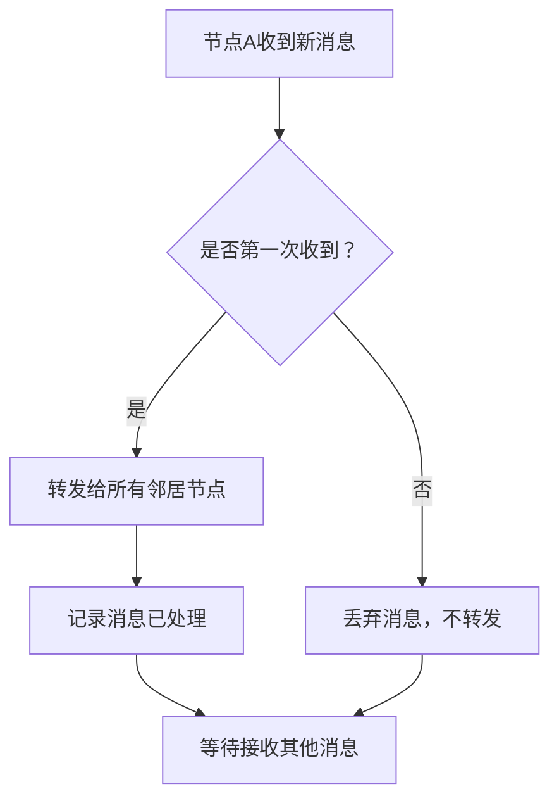
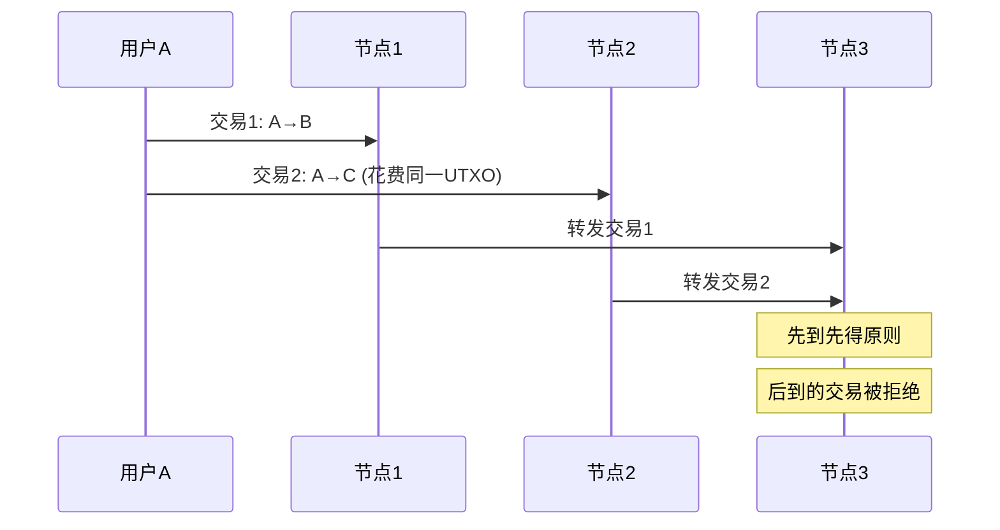

# 比特币网络原理详解

## 1. 网络架构概述

比特币作为去中心化数字货币，其核心技术建立在一个分布式的点对点（P2P）网络之上。这个网络架构可以分为两个主要层级：

| 层级 | 协议 | 功能 |
|------|------|------|
| **应用层** | Bitcoin Blockchain | 区块链协议、交易验证、共识机制 |
| **网络层** | P2P Overlay Network | 节点发现、消息传播、网络维护 |

比特币工作在应用层，其底层依托于一个P2P覆盖网络（Overlay Network），这种设计确保了系统的去中心化特性。

## 2. P2P网络特性

### 2.1 节点平等性

比特币的P2P网络具有以下关键特征：

- **完全对等**：所有节点在网络中的地位完全平等，没有特权节点
- **无中心化控制**：不存在超级节点（super node）或主节点（master node）
- **自主参与**：每个节点都可以自由加入或离开网络

这种设计与其他一些P2P网络（如BitTorrent中的tracker节点）形成鲜明对比。

### 2.2 节点加入与退出机制

#### 加入网络
1. **种子节点**：新节点需要至少一个种子节点（seed node）作为入口
2. **节点发现**：种子节点会提供其已知的其他节点信息
3. **连接建立**：通过TCP协议与邻居节点建立连接，有利于穿透防火墙

#### 退出网络
- **无需通知**：节点可以直接退出应用程序，无需向其他节点发送离线通知
- **自动清理**：其他节点通过超时机制检测到无响应后，会自动清理该节点信息

## 3. 网络设计原则

比特币网络的设计遵循三个核心原则：

```
Simple（简单） + Robust（鲁棒） - Efficient（效率） = Bitcoin Network
```

### 3.1 简单性（Simple）
- 协议规则明确，易于实现和理解
- 节点行为模式统一，降低复杂性

### 3.2 鲁棒性（Robust）
- 网络具有强抗攻击能力
- 单点故障不会影响整体网络运行
- 去中心化架构提供天然的容错能力

### 3.3 效率权衡
- 为了保证安全性和去中心化，在效率方面做出了一定牺牲
- 消息传播采用洪泛方式，带宽消耗较大

## 4. 消息传播机制

### 4.1 洪泛式传播（Flooding）

比特币网络采用洪泛式消息传播机制：



### 4.2 邻居节点选择

- **随机选择**：邻居节点的选取完全随机，不考虑地理位置或网络拓扑
- **全球分布**：一个位于加利福尼亚的节点可能与阿根廷的节点直接相连
- **优势**：增强网络鲁棒性，防止区域性攻击
- **代价**：牺牲传播效率，增加网络延迟

## 5. 交易处理机制

### 5.1 交易池维护

每个节点都维护一个**未确认交易池**（Mempool），用于存储等待上链的交易：

1. **接收验证**：节点收到新交易时进行合法性检查
2. **存储转发**：合法交易存入交易池并转发给邻居节点
3. **重复过滤**：已知交易不再重复处理

### 5.2 交易合法性检查

节点在处理交易时需要验证：

- ✅ **数字签名**：确认交易的合法授权
- ✅ **UTXO状态**：确认输入未被花费（避免双重花费）
- ✅ **格式正确性**：交易数据结构符合协议规范

## 6. 竞态条件与双重花费

### 6.1 竞态条件场景

当网络中出现冲突交易时会产生竞态条件：



### 6.2 处理策略

1. **先到先得**：节点优先接受最先收到的交易
2. **冲突检测**：后续冲突交易被标记为非法并拒绝转发
3. **区块确认更新**：
   - 如果区块包含已存储的交易 → 从交易池中删除该交易
   - 如果区块包含冲突交易 → 删除交易池中的相关冲突交易

## 7. 区块传播机制

### 7.1 区块验证与传播

新区块的传播流程类似于交易，但验证更加严格：

- **内容合法性**：验证区块中所有交易的合法性
- **链式结构**：确认区块在最长合法链上
- **工作量证明**：验证PoW难度是否满足要求

### 7.2 区块大小限制

- **最大限制**：比特币协议设定区块最大为1MB
- **传播影响**：区块越大，网络传播时间越长
- **传播时间**：1MB区块需要几十秒才能传播给大多数节点

## 8. 网络特性与局限性

### 8.1 Best Effort传播

比特币网络的消息传播属于"尽力而为"模式：

- ❌ **不保证到达**：交易不一定能到达所有节点
- ❌ **顺序不确定**：不同节点接收消息的顺序可能不同
- ❌ **延迟不确定**：网络延迟可能很长且不可预测

### 8.2 节点行为差异

实际网络中存在各种节点行为：

- 📢 **标准节点**：严格按照协议转发合法交易
- 🔇 **选择性节点**：可能不转发某些交易
- ⚠️ **异常节点**：可能转发非法交易

## 9. 网络安全考虑

### 9.1 攻击抵御

- **Sybil攻击**：随机邻居选择降低攻击效果
- **Eclipse攻击**：多样化连接提供保护
- **网络分割**：全球分布式架构增强抗分割能力

### 9.2 网络监控

- **节点监控**：通过超时机制检测节点状态
- **消息追踪**：记录已处理消息防止重复传播
- **性能监控**：跟踪网络传播延迟和覆盖率

## 10. 总结

比特币P2P网络通过牺牲一定的效率来换取系统的简单性和鲁棒性。这种设计选择使得比特币网络能够：

- 🔒 **保持去中心化**：没有单点故障
- 🛡️ **抵抗攻击**：分布式架构难以被攻击
- 🔄 **自我维护**：节点自主加入和退出
- 📈 **可扩展性**：新节点可以随时加入网络

虽然这种设计在传播效率和带宽使用上存在一定局限性，但为比特币系统的安全性和去中心化特性奠定了坚实的基础。随着网络技术的发展和Layer 2解决方案的出现，这些效率问题正在逐步得到解决。