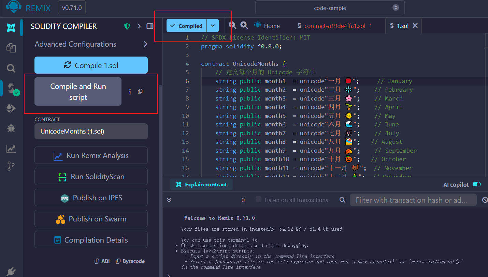
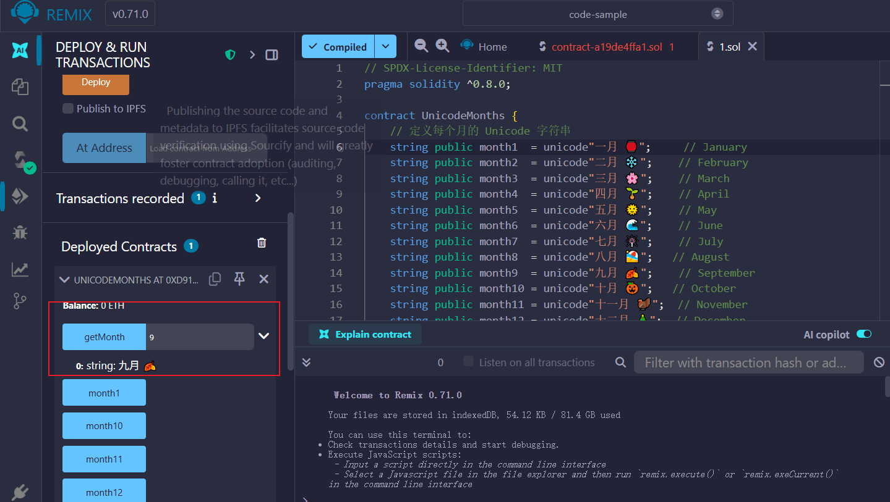

# Solidity 课堂笔记补充 - 类型

课堂笔记主要是针对于官网的一些教程知识点的补充，不做全量的记录，主要内容还是依据官网

[[toc]]

## 幂运算

- https://docs.soliditylang.org/zh-cn/latest/types.html#id11

### 总结

* `x ** y` 中，`y` 必须是无符号整数
* 结果的类型和基数 `x` 的类型相同，可能会溢出
* EVM 用 `EXP` 操作码来计算，成本和指数大小相关；小指数时可能直接优化成乘法链
* 建议测试 Gas 成本，并启用优化器
* 特殊情况：`0 ** 0 = 1`

## 定长浮点型

- [定长浮点型](https://docs.soliditylang.org/zh-cn/latest/types.html#index-4)

### 小结

1. Solidity 有 `fixed / ufixed` 定长浮点型，但目前不能实际使用
2. 它的设计是 **总位数 M** + **小数位数 N** 的组合
3. 和常见的浮点型（float/double）不同，定长浮点型的小数点位置固定，计算结果更可预测
4. 未来会支持算术和比较运算，目前只是语法占位

## 地址类型

- https://docs.soliditylang.org/zh-cn/latest/types.html#address

### 地址类型的两种形式

在 Solidity 里，地址有两种类型：

**`address`**

* 存储一个 **20 字节（160 位）** 的值
* 这是以太坊地址的大小
* 可以用来保存普通账户（EOA）或合约地址
* 但是 **不能直接转账以太币**

**`address payable`**

* 也是 20 字节
* 多了 **转账方法**：`transfer()` 和 `send()`
* 表示"能接收以太币的地址"

设计的初衷是：**不是所有地址都能收以太币**。
例如：

* 普通 `address` 可能指向一个合约，但该合约没有 `receive` 或 `payable fallback`，转账会失败
* 所以 Solidity 把"可转账"和"不可转账"分开，增强安全性

### 类型转换规则

**`address payable → address`**

* 可以 **隐式转换**，因为 `address payable` 本质上就是地址

```solidity
address payable a = payable(msg.sender);
address b = a; // OK, 隐式转换
```

**`address → address payable`**

* 必须 **显式转换**：

```solidity
address b = msg.sender;
address payable a = payable(b); // 必须用 payable()
```

**和其他类型之间的转换**

* 可以从 `uint160`、整数、`bytes20`、合约类型 → `address`
* 比如：

```solidity
uint160 x = 0x1234;
address a = address(x);
```

**`payable(...)` 特殊规则**

* 只有 `address` 和"能收以太的合约类型"能被 `payable(...)` 转换成 `address payable`
* 特殊例外：`payable(0)` 是合法的（空地址）

### 合约类型转换

* 合约可以 **显式转换**为 `address` 或 `address payable`
* 但只有在合约能接收以太时，才允许转成 `address payable`
* 即该合约必须定义 `receive()` 或 `fallback() payable`

例如：

```solidity
contract Receiver {
    receive() external payable {}
}

Receiver r = new Receiver();
address payable addr = payable(r); // OK，因为合约能收钱
```

### 运算符支持

`address` 和 `address payable` 支持比较运算：

* `<=`, `<`, `==`, `!=`, `>=`, `>`

常见用法是判断地址是否相等：

```solidity
if (msg.sender == owner) { ... }
```

### 大字节类型转 address 的截断问题 ⚠️

* `address` 只有 **20 字节**，但如果你从 `bytes32` 转换，就必须明确说明怎么截断

例如：

```solidity
bytes32 b = 0x111122333344556677888899AAAABBBBCCCCDDDDEEFFFFCCCC;
```

两种写法：

**`address(uint160(bytes20(b)))`**

* 取前 20 字节
* 结果：`0x111122223333444455556666777788889999aAaa`

**`address(uint160(uint256(b)))`**

* 先转成 `uint256`，再截断为低 160 位
* 结果：`0x777788889999AaAAbBbbCcccddDdeeeEfFFfCcCc`

所以转换时要小心，否则可能拿到完全不同的地址。

### EIP-55 地址字面量

* Solidity 支持符合 **EIP-55 标准** 的地址字面量
* 也就是 **混合大小写** 的 16 进制地址，带校验功能

```solidity
address constant myAddr = 0x52908400098527886E0F7030069857D2E4169EE7;
```

### 总结

1. `address` = 20 字节，不能收钱
2. `address payable` = 20 字节，能用 `transfer` / `send` 收钱
3. `address payable → address` 可以隐式，反之必须 `payable(addr)`
4. 从大字节类型（bytes32）转换时需要显式截断，否则结果可能完全不同
5. 合约要能收钱，必须写 `receive()` 或 `fallback() payable`
6. `payable(0)` 是合法的

## 地址类型成员变量

- https://docs.soliditylang.org/zh-cn/latest/types.html#members-of-addresses

### `this` 关键字

在 Solidity 中，`this` 代表 **当前合约自身**，而且它是一个 **合约类型**（即 `CurrentContract`）。

举个例子：

```solidity
contract Demo {
    function whoAmI() public view returns (address) {
        return address(this);
    }
}
```

这里 `address(this)` 就会返回当前合约的地址。

### `address(this)`

`this` 是"合约类型"，而 `address(this)` 是把它 **强制转换为地址类型**，得到的就是当前合约在区块链上的地址（20字节）。

注意：合约部署后本身就是一个账户，所以它也有 **地址**、**余额**。

### 代码解析

```solidity
address payable x = payable(0x123);  // 指定一个可接收转账的地址
address myAddress = address(this);   // 当前合约的地址
if (x.balance < 10 && myAddress.balance >= 10) x.transfer(10);
```

逐行含义：

1. `x`：这是一个 `payable` 地址，表示它可以接收以太币
2. `myAddress`：这是当前合约的地址（不可 `payable`，因为只是 `address` 类型）
3. `x.balance < 10`：检查目标地址余额是否小于 10 wei
4. `myAddress.balance >= 10`：检查合约自己是否至少有 10 wei
5. `x.transfer(10)`：如果条件满足，合约给 `x` 转账 10 wei

### 为什么要写 `address(this)`？

因为：

* `this` 的类型是合约，不是 `address`
* 但在区块链里，只有地址才有 `.balance` 这样的属性
* 所以要显式转换：`address(this)`

总结：`address myAddress = address(this);` 的意思就是：**把当前合约实例转换成地址，并赋值给 `myAddress` 变量，用于查询余额或转账等操作。**

## bytes memory 与 bytes 的区别

### 基本概念差异

**`bytes`**:
- 是一个**状态变量类型**
- 默认存储在 **storage** 中
- 是动态数组，可以在运行时改变大小
- 数据持久化存储在区块链上

**`bytes memory`**:
- 是一个**临时变量类型**
- 存储在 **memory** 中
- 函数执行完毕后数据会被清除
- 不会持久化到区块链上

### 实际应用示例

```solidity
contract BytesExample {
    // 状态变量：存储在 storage 中
    bytes public storageBytes;
    
    function demonstrateBytes() external {
        // 1. storage bytes - 持久化存储
        storageBytes = "Hello World";  // 写入区块链存储
        
        // 2. memory bytes - 临时存储
        bytes memory memoryBytes = "Temporary Data";
        
        // 3. 函数参数通常使用 memory
        processData(memoryBytes);
        
        // 4. 从 storage 读取到 memory
        bytes memory copyFromStorage = storageBytes;
        
        // 5. 将 memory 数据写入 storage
        storageBytes = memoryBytes;
    }
    
    function processData(bytes memory data) internal pure {
        // data 是临时的，函数结束后消失
        // 可以修改但不会影响原始数据
        data[0] = 'X';  // 只修改 memory 中的副本
    }
}
```

### 存储位置详解

| 类型 | 存储位置 | 特点 | Gas成本 | 持久性 |
|------|----------|------|---------|--------|
| `bytes` | storage | 状态变量，持久化 | 高（每32字节约20,000 gas） | 永久存储 |
| `bytes memory` | memory | 临时变量 | 低（每32字节约3 gas） | 函数执行期间 |
| `bytes calldata` | calldata | 只读，来自外部调用 | 最低 | 调用期间 |

### 函数参数中的使用

```solidity
contract ParameterExample {
    bytes storageData;
    
    // ✅ 推荐：外部函数参数使用 calldata（最省 gas）
    function externalFunction(bytes calldata data) external {
        // data 是只读的，来自调用者
        processInternalData(data);
    }
    
    // ✅ 推荐：公共函数参数使用 memory
    function publicFunction(bytes memory data) public {
        // 可以修改 data
        data[0] = 'A';
    }
    
    // ✅ 内部函数可以使用 memory
    function processInternalData(bytes calldata data) internal {
        bytes memory workingCopy = data;  // 复制到 memory 进行处理
        workingCopy[0] = 'B';
    }
    
    // ❌ 错误：不能直接将 calldata 赋值给 storage
    function wrongFunction(bytes calldata data) external {
        // storageData = data;  // 编译错误
        storageData = data;     // 需要显式转换
    }
}
```

### 数据位置转换

```solidity
contract DataLocationConversion {
    bytes storageBytes = "Storage Data";
    
    function conversionExamples() external {
        // Storage → Memory（复制）
        bytes memory memCopy = storageBytes;
        
        // Memory → Storage（复制）
        storageBytes = memCopy;
        
        // 修改 memory 不影响 storage
        memCopy[0] = 'X';
        // storageBytes 仍然是 "Storage Data"
        
        // 直接修改 storage
        storageBytes[0] = 'Y';
        // 现在 storageBytes 是 "Ytorage Data"
    }
    
    function calldataExample(bytes calldata data) external {
        // Calldata → Memory（复制）
        bytes memory memData = data;
        
        // Calldata → Storage（复制）
        storageBytes = data;
        
        // ❌ 不能修改 calldata
        // data[0] = 'X';  // 编译错误
    }
}
```

### Gas 消耗对比

```solidity
contract GasComparison {
    bytes storageData;
    
    function storageOperation() external {
        // 昂贵：写入 storage
        storageData = "This costs a lot of gas";  // ~44,000 gas
    }
    
    function memoryOperation() external pure {
        // 便宜：只在 memory 中操作
        bytes memory tempData = "This is cheap";  // ~200 gas
        tempData[0] = 'X';  // 几乎免费
    }
    
    function calldataOperation(bytes calldata data) external pure {
        // 最便宜：直接读取 calldata
        bytes1 firstByte = data[0];  // ~3 gas
    }
}
```

### 最佳实践建议

1. **外部函数参数**：优先使用 `bytes calldata`（最省gas）
2. **内部处理**：使用 `bytes memory`
3. **持久化存储**：使用 `bytes`（状态变量）
4. **临时计算**：使用 `bytes memory`
5. **只读操作**：使用 `bytes calldata`

### 总结

- `bytes` = 持久化的动态字节数组，存储在区块链上
- `bytes memory` = 临时的动态字节数组，仅在函数执行期间存在
- 选择哪个主要取决于数据的生命周期和gas优化需求

## 有理数和整数字面量

- https://docs.soliditylang.org/zh-cn/latest/types.html#rational-literals

### 总结

* Solidity 数字字面量支持整数、小数、科学计数法、下划线分隔
* 字面量表达式计算时不会溢出、不会截断
* 一旦和非字面量混用，就必须能转换成某种实际类型，否则报错
* 旧版本 (<0.4.0)：整除会截断；新版本：结果是有理数（更准确）

## 字符串字面量和类型

- [字符串字面量和类型](https://docs.soliditylang.org/zh-cn/latest/types.html#string-literals)

### 总结

Solidity 的字符串常量就是一段没有 \0 结尾的字节序列，可以写在 ' ' 或 " " 中，支持拼接和常见转义符，还能隐式转为 bytesN、bytes、string 等类型。

## Unicode 字面量

- [Unicode 常量](https://docs.soliditylang.org/zh-cn/latest/types.html#unicode)

```solidity
// SPDX-License-Identifier: MIT
pragma solidity ^0.8.0;

contract UnicodeExamples {
    // 普通 ASCII 字符串
    string public asciiText = "Hello, World!";

    // Unicode 字面量：带 emoji
    string public emojiText = unicode"Hello 😃🌍";

    // Unicode 字面量：带中文
    string public chineseText = unicode"你好，以太坊";

    // Unicode 字面量：带阿拉伯语
    string public arabicText = unicode"مرحبا إيثيريوم";

    // Unicode 字面量：带数学符号
    string public mathSymbols = unicode"∑ ∞ √ π";

    // Unicode 字面量：混合
    string public mixed = unicode"Solidity ❤️ 智能合约 🚀";
}
```

🔑 小结：

* `unicode"..."` 前缀告诉编译器这是一个 **Unicode 字面量**。
* 可以包含任意合法的 UTF-8 字符（中文、emoji、数学符号、阿拉伯语等）。
* 和普通字符串一样，也支持转义字符，例如 `\n`、`\t`、`\\` 等。

### 合约示例

```solidity
// SPDX-License-Identifier: MIT
pragma solidity ^0.8.0;

contract UnicodeMonths {
    // 定义每个月的 Unicode 字符串
    string public month1  = unicode"一月 🏮";     // January
    string public month2  = unicode"二月 ❄️";    // February
    string public month3  = unicode"三月 🌸";    // March
    string public month4  = unicode"四月 🌱";    // April
    string public month5  = unicode"五月 🌞";    // May
    string public month6  = unicode"六月 🌊";    // June
    string public month7  = unicode"七月 🎆";    // July
    string public month8  = unicode"八月 🏖️";   // August
    string public month9  = unicode"九月 🍂";    // September
    string public month10 = unicode"十月 🎃";   // October
    string public month11 = unicode"十一月 🦃";  // November
    string public month12 = unicode"十二月 🎄";  // December

    // 提供一个函数：输入 1-12 返回对应的月份
    function getMonth(uint8 month) external pure returns (string memory) {
        if (month == 1)  return unicode"一月 🏮";
        if (month == 2)  return unicode"二月 ❄️";
        if (month == 3)  return unicode"三月 🌸";
        if (month == 4)  return unicode"四月 🌱";
        if (month == 5)  return unicode"五月 🌞";
        if (month == 6)  return unicode"六月 🌊";
        if (month == 7)  return unicode"七月 🎆";
        if (month == 8)  return unicode"八月 🏖️";
        if (month == 9)  return unicode"九月 🍂";
        if (month == 10) return unicode"十月 🎃";
        if (month == 11) return unicode"十一月 🦃";
        if (month == 12) return unicode"十二月 🎄";
        return unicode"无效月份 🚫"; // 输入不合法时
    }
}
```

---

### 🔹 在 Remix 里测试效果：

1. 把代码粘贴到 Remix → Solidity 文件里。
2. 编译并部署 `UnicodeMonths`。
3. 在部署的合约中：
   * 直接点击 `month1`、`month2` 等公共变量，可以看到对应的字符串（中文+emoji）。
   * 调用 `getMonth(3)` 会返回 `"三月 🌸"`，调用 `getMonth(12)` 会返回 `"十二月 🎄"`。

具体如图：





## 十六进制字面量

- [十六进制常量](https://docs.soliditylang.org/zh-cn/latest/types.html#index-12)


---

### 🔹 示例 1：最简单的十六进制字面量

```solidity
bytes1 a = hex"FF";        // 1 字节，值为 0xFF
bytes2 b = hex"1234";      // 2 字节，值为 0x12 0x34
bytes4 c = hex"DEADBEEF";  // 4 字节
```

---

###  🔹 示例 2：使用下划线分隔

```solidity
bytes3 x = hex"12_34_56";  // 等价于 hex"123456"
```

---

###  🔹 示例 3：多个字面量拼接

```solidity
bytes8 y = hex"00112233" hex"44556677";  
// 等价于 hex"0011223344556677"
```

---

###  🔹 示例 4：作为常量定义

```solidity
contract HexExample {
    bytes constant data1 = hex"ABCD";
    bytes constant data2 = hex"AB" hex"CD"; // 拼接后等价于 hex"ABCD"
}
```

---

## 🔹 示例 5：错误示例（不能直接转 string）

```solidity
// string s = hex"414243";   // ❌ 报错：不能隐式转换为 string
bytes3 b = hex"414243";      // ✅ 正确，等价于 ASCII "ABC"
```

---

### 📌 总结

1. **语法**

   * 以 `hex` 开头，后跟 `"..."` 或 `'...'`。
   * 内容必须是偶数个十六进制字符（每两个十六进制字符表示 1 字节）。
   * 允许用 `_` 作为分隔符提高可读性。

2. **拼接**

   * 多个 `hex"..."` 中间用空格隔开，会自动拼接成一个字节序列。

3. **类型**

   * 十六进制字面量生成的是 **原始字节序列**，常用于赋值给 `bytesN` 或 `bytes`。
   * 不能 **隐式** 转换成 `string`，因为它表示的是二进制，不一定是 UTF-8 编码的文本。

4. **使用场景**

   * 常见于合约开发中存放 **哈希值、地址前缀、原始二进制数据** 等。

## Solidity 枚举简单总结

Solidity 中的枚举是一种用户定义类型，具有以下特点：
- 可以与整数类型显式转换，但不能隐式转换，运行时会检查转换值是否在有效范围内
- 至少需要一个成员，默认值是第一个成员，最多支持 256 个成员, 成员从 0 开始按顺序编号
- 可以用 `type(EnumName).min` 和 `type(EnumName).max` 获取最值
- 枚举也可以在文件级别上声明，在合约或库定义之外。

```solidity
// SPDX-License-Identifier: MIT
pragma solidity ^0.8.0;

contract EnumExample {
    // 定义订单状态枚举
    enum OrderStatus {
        Pending,    // 0
        Confirmed,  // 1
        Shipped,    // 2
        Delivered,  // 3
        Cancelled   // 4
    }
    
    // 订单结构
    struct Order {
        uint256 id;
        OrderStatus status;
    }
    
    mapping(uint256 => Order) public orders;
    uint256 public orderCounter;
    
    // 创建新订单
    function createOrder() public returns (uint256) {
        orderCounter++;
        orders[orderCounter] = Order({
            id: orderCounter,
            status: OrderStatus.Pending  // 默认状态
        });
        return orderCounter;
    }
    
    // 更新订单状态
    function updateOrderStatus(uint256 orderId, OrderStatus newStatus) public {
        require(orders[orderId].id != 0, "Order does not exist");
        orders[orderId].status = newStatus;
    }
    
    // 通过整数设置状态（显式转换）
    function setOrderStatusByInt(uint256 orderId, uint8 statusInt) public {
        require(orders[orderId].id != 0, "Order does not exist");
        require(statusInt <= uint8(type(OrderStatus).max), "Invalid status");
        
        orders[orderId].status = OrderStatus(statusInt);
    }
    
    // 获取订单状态的整数值
    function getOrderStatusInt(uint256 orderId) public view returns (uint8) {
        require(orders[orderId].id != 0, "Order does not exist");
        return uint8(orders[orderId].status);
    }
    
    // 获取枚举的最值
    function getEnumMinMax() public pure returns (uint8 min, uint8 max) {
        min = uint8(type(OrderStatus).min);  // 0
        max = uint8(type(OrderStatus).max);  // 4
    }
    
    // 检查订单是否已完成
    function isOrderCompleted(uint256 orderId) public view returns (bool) {
        require(orders[orderId].id != 0, "Order does not exist");
        OrderStatus status = orders[orderId].status;
        return status == OrderStatus.Delivered || status == OrderStatus.Cancelled;
    }
}
```

## 用户定义的值类型

- [用户定义的值类型](https://docs.soliditylang.org/zh-cn/latest/types.html#user-defined-value-types)


### 小结

1. 用户定义值类型使用 `type C is V` 语法定义
2. 提供了一个零成本的类型抽象，类似于类型别名但有更严格的类型要求
3. 主要特点：
   - 没有任何运算符或额外的成员函数（包括 `==`）
   - 不允许与其他类型进行显式和隐式转换
   - 数据表示从底层类型继承
   - 使用 `C.wrap` 从底层类型转换到自定义类型
   - 使用 `C.unwrap` 从自定义类型转换到底层类型

### 使用示例

最常见的用例是创建具有特定语义的类型，比如：

```solidity
// 定义一个18位小数的定点数类型
type UFixed256x18 is uint256;
```

注意事项：
- `UFixed256x18.wrap` 保持数据表示不变
- 需要额外的库函数来进行实际的定点数运算
- 这种设计可以防止不同单位或不兼容类型之间的意外混合运算

## 函数类型

- https://docs.soliditylang.org/zh-cn/latest/types.html#function-types

### 可见性修饰符 {public|private|internal|external}

- https://docs.soliditylang.org/en/latest/contracts.html#function-visibility

#### internal
- **作用范围**：只能在合约内部或继承的合约中调用
- **不能**被外部账户直接调用
- **可以**被同一合约的其他函数调用
- **可以**被继承合约调用

#### external  
- **作用范围**：只能从合约外部调用
- **可以**被外部账户调用
- **可以**被其他合约调用
- **不能**被同一合约内部直接调用（除非使用 `this.functionName()`）

#### public

- 任何地方都可以访问，自动生成getter函数

#### private

- 只能在当前合约内部访问

### 状态可变性修饰符 [pure|view|payable]

#### pure(纯净的)
- **不读取**区块链状态
- **不修改**区块链状态
- 只进行纯计算，基于输入参数返回结果
- **Gas消耗**：调用时不消耗gas（除非在交易中调用）

#### view
- **可以读取**区块链状态
- **不能修改**区块链状态
- 可以访问状态变量、其他view/pure函数等
- **Gas消耗**：调用时不消耗gas（除非在交易中调用）

#### payable
- **可以接收**以太币
- **可以修改**区块链状态
- 如果函数需要接收ETH，必须标记为payable
- **Gas消耗**：调用时消耗gas

#### 默认情况（无修饰符）
- **可以修改**区块链状态
- **不能接收**以太币
- **Gas消耗**：调用时消耗gas

### 总结对比

| 修饰符 | 可见性 | 状态读取 | 状态修改 | 接收ETH | Gas消耗 | 使用场景 |
|--------|--------|----------|----------|---------|---------|----------|
| `internal` | 合约内部+继承 | - | - | - | - | 内部工具函数 |
| `external` | 仅外部调用 | - | - | - | - | 对外接口 |
| `pure` | - | ❌ | ❌ | ❌ | 免费* | 纯计算函数 |
| `view` | - | ✅ | ❌ | ❌ | 免费* | 查询状态 |
| `payable` | - | ✅ | ✅ | ✅ | 消耗 | 接收ETH |
| 默认 | - | ✅ | ✅ | ❌ | 消耗 | 修改状态 |

**注意**：
1. **可见性**和**状态可变性**可以组合使用
2. `pure`和`view`函数在外部直接调用时免费，但在交易中调用时仍消耗gas
3. 每个函数必须有且仅有一个可见性修饰符
4. 状态可变性修饰符是可选的，不写则默认可以修改状态但不能接收ETH

### 示例

* 官网示例详解

```solidity
// SPDX-License-Identifier: GPL-3.0
pragma solidity >=0.4.16 <0.9.0;

library ArrayUtils {
    // ========== MAP 函数详解 ==========
    // map函数：对数组每个元素应用一个转换函数
    function map(
        uint[] memory self,                           // 输入数组
        function (uint) pure returns (uint) f        // 转换函数（函数作为参数）
    )
        internal
        pure
        returns (uint[] memory r)                     // 返回转换后的新数组
    {
        r = new uint[](self.length);                  // 创建相同长度的新数组
        for (uint i = 0; i < self.length; i++) {
            r[i] = f(self[i]);                        // 对每个元素应用函数f
        }
    }

    // ========== REDUCE 函数详解 ==========
    // reduce函数：将数组所有元素合并成单个值
    function reduce(
        uint[] memory self,                           // 输入数组
        function (uint, uint) pure returns (uint) f   // 累积函数（接受两个参数）
    )
        internal
        pure
        returns (uint r)                              // 返回单个累积值
    {
        r = self[0];                                  // 用第一个元素作为初始值
        for (uint i = 1; i < self.length; i++) {     // 从第二个元素开始
            r = f(r, self[i]);                       // 累积计算：r = f(累积值, 当前元素)
        }
    }

    // ========== RANGE 函数详解 ==========
    // range函数：生成从0到length-1的数组
    function range(uint length) internal pure returns (uint[] memory r) {
        r = new uint[](length);                       // 创建指定长度的数组
        for (uint i = 0; i < r.length; i++) {
            r[i] = i;                                 // 填充：[0, 1, 2, 3, ...]
        }
    }
}

contract Pyramid {
    using ArrayUtils for *;  // 为所有类型启用ArrayUtils库

    // ========== 主函数：计算平方和 ==========
    function pyramid(uint l) public pure returns (uint) {
        // 执行流程：
        // 1. ArrayUtils.range(l) → 生成 [0, 1, 2, ..., l-1]
        // 2. .map(square) → 应用square函数 → [0, 1, 4, 9, ...]
        // 3. .reduce(sum) → 累加求和 → 0+1+4+9+...
        return ArrayUtils.range(l).map(square).reduce(sum);
    }

    // ========== 辅助函数 ==========
    
    // 平方函数：x → x²
    function square(uint x) internal pure returns (uint) {
        return x * x;
    }

    // 求和函数：(x, y) → x + y
    function sum(uint x, uint y) internal pure returns (uint) {
        return x + y;
    }
    
    // ========== 详细演示函数 ==========
    
    // 分步演示pyramid函数的执行过程
    function pyramidDetailed(uint l) public pure returns (uint[] memory, uint[] memory, uint) {
        // 步骤1：生成范围数组
        uint[] memory rangeArray = ArrayUtils.range(l);
        
        // 步骤2：每个元素平方
        uint[] memory squaredArray = rangeArray.map(square);
        
        // 步骤3：求和
        uint total = squaredArray.reduce(sum);
        
        return (rangeArray, squaredArray, total);
    }
    
    // 演示不同的转换函数
    function demonstrateMap() public pure returns (uint[] memory, uint[] memory, uint[] memory) {
        uint[] memory original = ArrayUtils.range(5);  // [0, 1, 2, 3, 4]
        
        // 使用不同的转换函数
        uint[] memory doubled = original.map(double);   // [0, 2, 4, 6, 8]
        uint[] memory squared = original.map(square);   // [0, 1, 4, 9, 16]
        
        return (original, doubled, squared);
    }
    
    // 演示不同的累积函数
    function demonstrateReduce() public pure returns (uint, uint, uint) {
        uint[] memory numbers = ArrayUtils.range(5);  // [0, 1, 2, 3, 4]
        
        uint sumResult = numbers.reduce(sum);          // 0+1+2+3+4 = 10
        uint productResult = numbers.reduce(multiply); // 0*1*2*3*4 = 0 (因为有0)
        uint maxResult = numbers.reduce(max);          // max(0,1,2,3,4) = 4
        
        return (sumResult, productResult, maxResult);
    }
    
    // ========== 更多示例函数 ==========
    
    function double(uint x) internal pure returns (uint) {
        return x * 2;
    }
    
    function multiply(uint x, uint y) internal pure returns (uint) {
        return x * y;
    }
    
    function max(uint x, uint y) internal pure returns (uint) {
        return x > y ? x : y;
    }
}

// ========== 使用示例合约 ==========
contract ArrayUtilsExample {
    using ArrayUtils for *;
    
    // 计算数组所有元素的立方和
    function cubeSum(uint length) public pure returns (uint) {
        return ArrayUtils.range(length).map(cube).reduce(add);
    }
    
    // 计算数组的乘积（跳过0）
    function nonZeroProduct(uint length) public pure returns (uint) {
        uint[] memory arr = ArrayUtils.range(length);
        // 先过滤掉0，然后求乘积
        uint[] memory filtered = new uint[](length - 1);
        for(uint i = 1; i < length; i++) {
            filtered[i-1] = i;
        }
        return filtered.reduce(multiply);
    }
    
    function cube(uint x) internal pure returns (uint) {
        return x * x * x;
    }
    
    function add(uint x, uint y) internal pure returns (uint) {
        return x + y;
    }
    
    function multiply(uint x, uint y) internal pure returns (uint) {
        return x * y;
    }
}
```

* 额外示例
  
```solidity
// SPDX-License-Identifier: MIT
pragma solidity ^0.8.0;

contract FunctionModifiersExample {
    uint256 public balance;
    uint256 private secretValue = 100;
    
    // ========== 可见性修饰符示例 ==========
    
    // internal: 只能在合约内部或继承合约中调用
    function internalFunction(uint256 value) internal returns (uint256) {
        return value * 2;
    }
    
    // external: 只能从外部调用
    function externalFunction(uint256 value) external returns (uint256) {
        // 可以调用internal函数
        return internalFunction(value);
    }
    
    // 演示internal函数的调用
    function callInternalFunction(uint256 value) external returns (uint256) {
        // 正确：可以调用internal函数
        return internalFunction(value);
        
        // 错误：不能直接调用external函数
        // return externalFunction(value);  // 这会报错
        
        // 正确：通过this调用external函数（但消耗更多gas）
        // return this.externalFunction(value);
    }
    
    // ========== 状态可变性修饰符示例 ==========
    
    // pure: 不读取也不修改状态
    function pureFunction(uint256 a, uint256 b) external pure returns (uint256) {
        // 只能进行纯计算
        return a + b * 2;
        
        // 错误：不能读取状态变量
        // return balance;  // 这会报错
    }
    
    // view: 可以读取状态，但不能修改
    function viewFunction() external view returns (uint256, uint256) {
        // 正确：可以读取状态变量
        uint256 currentBalance = balance;
        uint256 secret = secretValue;
        
        // 正确：可以进行计算
        uint256 calculated = currentBalance * 2;
        
        // 错误：不能修改状态变量
        // balance = 100;  // 这会报错
        
        return (currentBalance, calculated);
    }
    
    // payable: 可以接收以太币
    function payableFunction() external payable {
        // 可以接收ETH
        balance += msg.value;
        
        // 可以修改状态
        secretValue = 200;
    }
    
    // 默认（可修改状态，不能接收ETH）
    function normalFunction(uint256 newValue) external {
        // 可以修改状态
        balance = newValue;
        secretValue = newValue;
        
        // 错误：不能接收以太币（没有payable）
        // 如果有人发送ETH到这个函数会失败
    }
    
    // ========== 组合使用示例 ==========
    
    // internal + view
    function internalViewFunction() internal view returns (uint256) {
        return balance + secretValue;
    }
    
    // external + pure
    function externalPureFunction(string memory str) external pure returns (bytes32) {
        return keccak256(abi.encodePacked(str));
    }
    
    // external + payable + 修改状态
    function deposit() external payable {
        require(msg.value > 0, "Must send some ETH");
        balance += msg.value;
    }
    
    // 获取合约ETH余额
    function getContractBalance() external view returns (uint256) {
        return address(this).balance;
    }
    
    // 提取ETH（仅演示，实际应用需要权限控制）
    function withdraw(uint256 amount) external {
        require(amount <= address(this).balance, "Insufficient balance");
        payable(msg.sender).transfer(amount);
        balance -= amount;
    }
}

// 演示继承中internal的使用
contract ChildContract is FunctionModifiersExample {
    // 可以调用父合约的internal函数
    function useParentInternal(uint256 value) external returns (uint256) {
        return internalFunction(value);  // 正确：可以访问父合约的internal函数
    }
    
    // 可以调用父合约的internal view函数
    function getParentValues() external view returns (uint256) {
        return internalViewFunction();  // 正确：可以访问
    }
}
```

## 引用类型

- [引用类型](https://docs.soliditylang.org/zh-cn/latest/types.html#reference-types)

这段内容主要讲解了Solidity中引用类型的特点和数据位置概念。让我为您总结一下：

**引用类型 vs 值类型**
- **引用类型**：可以通过多个名称修改同一个值，需要更谨慎处理
- **值类型**：使用时得到独立副本
- **引用类型包括**：结构、数组、映射

**三种数据位置**
1. **memory**：临时存储，生命周期限于函数调用
2. **storage**：持久存储，存储状态变量，生命周期等于合约生命周期  
3. **calldata**：不可修改的临时区域，主要存储函数参数，类似memory但更节省gas

**赋值行为规则**
- **跨位置赋值**（storage ↔ memory，calldata → 其他）：**总是创建独立拷贝**
- **memory内部赋值**：**只创建引用**，修改会影响所有引用同一数据的变量
- **storage内部赋值**：**只赋值引用**（local storage变量间）
- **其他storage赋值**：**总是拷贝**

**重要提示**
- 引用类型必须明确指定数据位置
- 优先使用calldata以节省gas和确保数据不被修改
- 版本0.6.9后，memory和calldata可在所有函数中使用

核心要点：**数据位置决定了数据的生命周期和赋值时的复制行为**。


###  数组字面常数

- [数组字面常数](https://docs.soliditylang.org/zh-cn/latest/types.html#index-21)

#### 示例

```solidity
pragma solidity >=0.4.16 <0.9.0;

contract C {
    function f() public pure returns (uint24[2][4] memory) {
        uint24[2][4] memory x = [[uint24(0x1), 1], [0xffffff, 2], [uint24(0xff), 3], [uint24(0xffff), 4]];
        // 下面的方法不会起作用，因为一些内部数组的类型不对。
        // uint[2][4] memory x = [[0x1, 1], [0xffffff, 2], [0xff, 3], [0xffff, 4]];
        return x;
    }
}
```

> [类型检测推导过程](./array-types-check.md)


###  对存储数组元素的悬空引用

- [对存储数组元素的悬空引用](https://docs.soliditylang.org/zh-cn/latest/types.html#dangling-references)
- [悬空引用示例详解](./dangling-reference.md)

## 映射类型

- [映射类型](https://docs.soliditylang.org/zh-cn/latest/types.html#mapping-types)
  - [详细介绍](./mapping-types.md)

### 递归映射

- [递归映射](https://docs.soliditylang.org/zh-cn/latest/types.html#iterable-mappings)
- [递归映射示例讲解](./iterator-mapping.md)

## 运算符

- [Solidity 官方文档 - 运算符](https://docs.soliditylang.org/zh-cn/latest/types.html)
- [Solidity 运算符完整指南](./operator.md)

## 基本类型之间的转换

- [Solidity 官方文档 - 基本类型之间的转换](https://docs.soliditylang.org/zh-cn/latest/types.html#types-conversion-elementary-types)
- [Solidity基本类型转换](./convert-types.md)

## 字面常数和基本类型之间的转换

- [Solidity 官方文档 - 字面常数和基本类型之间的转换](https://docs.soliditylang.org/zh-cn/latest/types.html#types-conversion-literals)
- [Solidity 字面常数和基本类型之间的转换](./types-conversion-literals.md)
