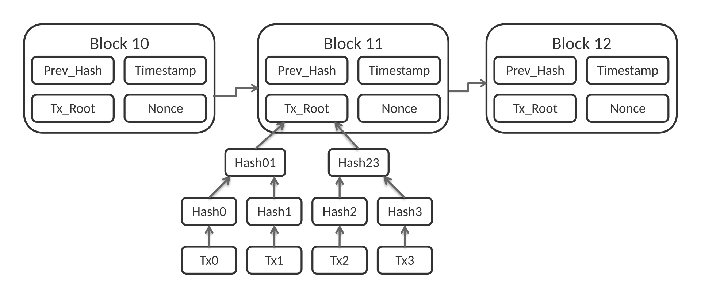

# 区块链简介

## 重要声明

> **重要提示**：此区块链教程为技术教程，教程的所有内容均不构成任何投资比特币或其他数字货币的意见和建议，也不赞成个人炒作任何数字货币！

## 什么是区块链?

区块链（英文名：blockchain或block chain）是一种块链式存储、不可篡改、安全可信的**去中心化**分布式账本，它结合了分布式存储、点对点传输、共识机制、密码学等技术，通过不断增长的数据块链（Blocks）记录交易和信息，确保数据的安全和透明性。

## 区块链的历史

区块链起源于比特币（Bitcoin），最初由中本聪（Satoshi Nakamoto）在2008年提出，作为比特币的底层技术。从诞生初期的比特币网络开始，区块链逐渐演化为一项全球性技术，吸引了全球的关注和投资。随后，以太坊（Ethereum）等新一代区块链平台的出现进一步扩展了应用领域 。

* [维基百科](https://zh.wikipedia.org/wiki/%E5%8C%BA%E5%9D%97%E9%93%BE)
* [百度百科](https://baike.baidu.com/item/%E5%8C%BA%E5%9D%97%E9%93%BE/13465666)

## 区块链的主要特性

1. **去中心化**

   * 区块链没有单一的中心机构，网络中的每个节点都可以参与记账与验证。
   * 避免了对单一第三方的依赖，降低了单点故障和被操纵的风险。

2. **不可篡改性**

   * 区块链数据一旦写入区块并被全网确认，就几乎无法更改。
   * 篡改某个区块的数据需要同时修改其后所有区块，并获得全网多数节点的认可，几乎不可能实现。

3. **可追溯性**

   * 每个区块都包含前一区块的哈希值，形成链式结构。
   * 交易信息全程可追溯，保证透明和可验证。

4. **公开透明**

   * 在公有链中，所有交易对所有节点公开，任何人都可以查看区块和交易记录。
   * 增强了系统的公信力。

5. **匿名性 / 假名性**

   * 用户通过公钥地址进行交易，而非真实身份。
   * 保持一定程度的隐私保护，但并非完全匿名。

6. **共识机制**

   * 区块链通过工作量证明（PoW）、权益证明（PoS）等机制来达成共识。
   * 确保在没有中心机构的情况下，节点能就交易达成统一结果。

7. **智能合约**（扩展特性）

   * 在以太坊等平台中，区块链支持智能合约。
   * 能够自动执行预设条件的合约条款，提升自动化和信任度。

---

## 区块链的数据结构

### 数据结构

**1. 整体结构**

区块链是由一系列区块按时间顺序链接而成的链式数据结构。每个区块都包含一批交易记录，并通过密码学[哈希函数](#哈希算法-梅克尔树区块指针比特币挖矿)与前一个区块连接。

**2. 区块结构**

每个区块主要包含两部分：

* 区块头（Block Header）：包含元数据
* 区块体（Block Body）：包含交易数据

**3. 区块头组成**

- 版本号（Version）：区块链协议版本
- 前一区块哈希（Previous Block Hash）：指向前一个区块
- 默克尔树根（Merkle Root）：所有交易的哈希摘要，它是[Merkle Root hash](#21-什么是-merkle-tree)记录了本区块所有交易
- 时间戳（Timestamp）：区块创建时间
- 难度目标（Difficulty Target）：挖矿难度
- 随机数（Nonce）：用于工作量证明

**4. 默克尔树结构**

默克尔树是一种二叉树结构，用于高效验证交易数据的完整性。叶子节点是交易哈希，非叶子节点是子节点哈希的组合哈希。



### 比特币区块结构源代码介绍

```cpp
// 区块头（总大小：80 字节）
int32_t nVersion;         // 4 字节，区块版本号，用于升级
uint256 hashPrevBlock;    // 32 字节，前一个区块的哈希值（区块链的链式结构关键）
uint256 hashMerkleRoot;   // 32 字节，当前区块所有交易的 Merkle 树根哈希
uint32_t nTime;           // 4 字节，区块产生的时间戳（Unix 时间）
uint32_t nBits;           // 4 字节，难度目标的压缩表示
uint32_t nNonce;          // 4 字节，随机数，挖矿时不断变化以寻找合适哈希
```

> 来源于：[bitcoin](https://github.com/bitcoin/bitcoin/blob/master/src/primitives/block.h)

### 可视化数据展示

<iframe src="/ethereum/data_structure.html" width="100%" height="800"></iframe>

## 加密算法

### 非对称加密算法 （私钥、公钥）

* 一对两把密钥，分别用于加密、解密（公开、私有）
* RSA算法：大整数分解；ECC算法：椭圆曲线
* 破解228比特的RSA密钥需要的能量可煮沸一茶匙的水，而破解228比特的ECC密钥需要的能量能煮沸地球上所有的水

### 哈希算法 （梅克尔树、区块指针、比特币挖矿）

哈希算法，又称散列算法，它是一个单向函数，可以把任意长度的输入数据转化为固定长度的输出

```
h=H(x)
```

* 任意长度消息压缩成固定长度的二进制串
* SHA家族
  * SHA-1（已被攻破）、SHA-256（比特币）、SHA-384、SHA-512
* MD4/MD5（已被攻破）


:::tip

例如，对morning和bitcoin两个输入进行某种哈希运算，得到的结果是固定长度的数字：

H("morning") = c7c3169c21f1d92e9577871831d067c8
H("bitcoin") = cd5b1e4947e304476c788cd474fb579a
我们通常用十六进制表示哈希输出。

因为哈希算法是一个单向函数，要设计一个安全的哈希算法，就必须满足：通过输入可以很容易地计算输出，但是，反过来，通过输出无法反推输入，只能暴力穷举。

H("???????") = c7c3169c21f1d92e9577871831d067c8
H("???????") = cd5b1e4947e304476c788cd474fb579a
:::

:::tip

2^256 是一个非常巨大的数字

这个数字有多大呢？它大约有78位数字，比可观测宇宙中的原子数量（大约10^80）还要接近。
计算时间取决于具体任务：

**1.直接计算2^256的值：**

* 现代计算机可以瞬间完成（毫秒级）
* 大多数编程语言都有大整数库支持

**2.如果是暴力破解2^256种可能性：**

* 这是密码学中的安全级别
* 即使用全世界最快的超级计算机，也需要比宇宙年龄长得多的时间
* 大约需要 10^60 年以上
:::

### 哈希碰撞

#### 什么是哈希碰撞？

哈希函数（Hash Function）是一种将任意长度的输入数据映射为固定长度输出值的算法。

由于 输入无限，输出有限，必然存在两个不同的输入得到相同的哈希值的情况（碰撞概率低），这就是 哈希碰撞（Hash Collision）。

```伪代码
H("data-111111") = a76b1fb579a02a476c789d9115d4b201
H("data-AAAAAA") = a76b1fb579a02a476c789d9115d4b201
```

#### 为什么会发生哈希碰撞？

哈希函数的输出长度有限，例如：

- MD5 → 128 位输出
- SHA-1 → 160 位输出
- SHA-256 → 256 位输出

不同输入经过哈希函数可能映射到相同的输出值。

## Merkle Root Hash

### 1. 概述

Merkle Root Hash（默克尔根哈希）是一种基于哈希树（Hash Tree）或默克尔树（Merkle Tree）的加密技术，由计算机科学家 Ralph Merkle 在 1979 年提出。它是现代区块链技术、分布式系统和数据完整性验证的核心组件之一。

### 2. 基本概念

#### 2.1 什么是 Merkle Tree

Merkle Tree 是一种二叉树数据结构，其中：
- **叶节点**：包含数据块的哈希值
- **非叶节点**：包含其两个子节点哈希值的组合哈希
- **根节点**：树的顶部节点，即 Merkle Root Hash

#### 2.2 Merkle Root Hash 定义

Merkle Root Hash 是 Merkle Tree 的根节点哈希值，它代表了整个数据集的唯一指纹。任何底层数据的微小变化都会导致根哈希的完全不同。

### 3. 工作原理

#### 3.1 构建过程

1. **数据分块**：将原始数据分割成固定大小的块
2. **计算叶节点哈希**：对每个数据块计算哈希值（如 SHA-256）
3. **逐层向上合并**：
   - 将相邻的两个哈希值连接
   - 对连接后的字符串再次计算哈希
   - 重复此过程直到只剩一个哈希值
4. **得到根哈希**：最终的哈希值即为 Merkle Root Hash

#### 3.2 示例构建过程

```
数据块: [A] [B] [C] [D]
        ↓   ↓   ↓   ↓
叶节点: H(A) H(B) H(C) H(D)
        ↓     ↓     ↓     ↓
第2层:  H(H(A)+H(B))   H(H(C)+H(D))
              ↓             ↓
根节点:       H(H(H(A)+H(B)) + H(H(C)+H(D)))
```

## 4. 核心特性

### 4.1 高效验证
- 只需 O(log n) 的时间复杂度即可验证任意数据块的完整性
- 无需下载完整数据集

### 4.2 数据完整性
- 任何数据的修改都会改变根哈希
- 提供强大的防篡改保证

### 4.3 紧凑表示
- 用单个哈希值代表任意大小的数据集
- 便于存储和传输

### 4.4 增量验证
- 支持部分数据验证而无需验证全部数据
- 通过 Merkle Proof 实现高效验证

### 5. 性能分析

#### 5.1 时间复杂度
- **构建**：O(n)，其中 n 是数据块数量
- **验证**：O(log n)
- **更新**：O(log n)

#### 5.2 空间复杂度
- **存储**：O(n) 用于存储完整树
- **验证**：O(log n) 用于存储证明路径

